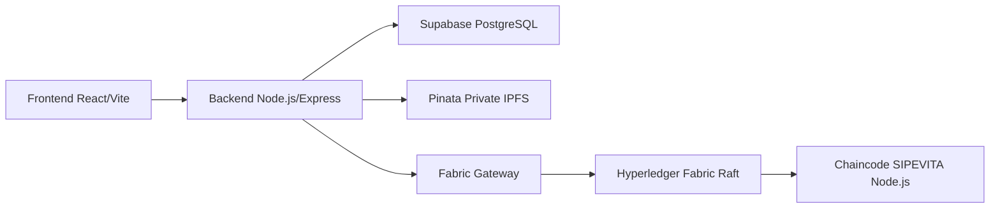

# Panduan Instalasi dan Implementasi Lokal SIPEVITA

Dokumen ini kami tulis sebagai panduan praktis untuk menjalankan SIPEVITA di
lingkungan lokal. Fokus utama panduan ini adalah Windows 10/11 dengan WSL2
Ubuntu, Docker Desktop, dan terminal Bash dari Ubuntu WSL2.

Untuk Linux native, langkahnya hampir sama selama Docker, Node.js, npm, dan
binary Hyperledger Fabric sudah tersedia di `PATH`.

## 1. Gambaran Singkat SIPEVITA

SIPEVITA adalah aplikasi pencatatan dan verifikasi transaksi pertanahan.
Di aplikasi ini, PPAT membuat pengajuan dan mengunggah dokumen pendukung.
ATR/BPN kemudian memeriksa pengajuan tersebut, mengklaim pekerjaan,
menolak, atau menyetujui pengajuan. Masyarakat umum bisa memverifikasi
sertifikat dan melihat riwayat publiknya melalui halaman verifikasi.

Komponen yang kami gunakan:

- `frontend`: aplikasi React/Vite untuk pengguna.
- `backend`: REST API Node.js/Express sebagai pusat komunikasi sistem.
- `Supabase/PostgreSQL`: penyimpanan data operasional aplikasi.
- `Pinata Private IPFS`: penyimpanan dokumen dan manifest pengajuan.
- `Cloudflare Turnstile`: proteksi login dan endpoint publik.
- `Hyperledger Fabric`: ledger untuk menyimpan bukti integritas dan riwayat
  transaksi.

Data pribadi dan file asli tidak disimpan langsung di blockchain. Blockchain
hanya menyimpan bukti seperti hash, CID, status, dan timestamp ledger.

Role aplikasi:

- `PPAT`: membuat pengajuan, mengunggah dokumen, dan mengirim pengajuan.
- `ATR_BPN`: memeriksa, mengklaim, menolak, atau menyetujui pengajuan.
- Publik: memverifikasi sertifikat dan riwayatnya tanpa login.

## 2. Arsitektur Sistem

Alur utama sistem :



Frontend hanya berkomunikasi dengan backend. Frontend tidak menyimpan
credential sensitif seperti Supabase service role key, Pinata JWT, wallet
Fabric, private key, sertifikat, atau connection profile.

Konfigurasi Fabric lokal yang kami pakai:

- 3 orderer Raft: `orderer1`, `orderer2`, dan `orderer3`.
- 4 organisasi peer: `Org1MSP`, `Org2MSP`, `Org3MSP`, dan `Org4MSP`.
- Channel: `mychannel`.
- Chaincode: `sipevita`.
- Source chaincode: `blockchain/sipevita-chaincode`.
- Network lokal: `blockchain/sipevita-raft-network`.
- Wallet aplikasi: `blockchain/sipevita-raft-network/wallet-raft/appUser.id`.

## 3. Struktur Folder


```text
sipevita-public/
├── backend/
├── frontend/
├── blockchain/
│   ├── sipevita-chaincode/
│   └── sipevita-raft-network/
├── backend/database/
└── docs/
```

Fungsi utamanya:

- `backend`: API Express, autentikasi, Supabase, Pinata, Turnstile, dan Fabric.
- `frontend`: aplikasi React/Vite.
- `blockchain/sipevita-chaincode`: source chaincode SIPEVITA.
- `blockchain/sipevita-raft-network`: konfigurasi jaringan Fabric Raft lokal.
- `backend/database`: referensi schema dan migration database.
- `docs`: dokumentasi teknis.

## 4. Prasyarat

Sebelum menjalankan project, harus menyiapkan:

- Windows 10/11 dengan WSL2 Ubuntu.
- Docker Desktop dengan WSL integration aktif.
- Node.js minimal versi 20.
- npm.
- Git.
- curl dan jq.
- Hyperledger Fabric binary 2.5.x: `peer`, `cryptogen`, `configtxgen`,
  dan `osnadmin`.

Cek dependency dasar:

```bash
docker --version
docker compose version
node --version
npm --version
git --version
curl --version
jq --version
peer version
cryptogen version
configtxgen --version
osnadmin version
```

Jika binary Fabric belum dikenali, tambahkan lokasi binary ke `PATH`. Contoh
umum jika binary Fabric disimpan di `fabric-samples/bin`:

```bash
export PATH="$HOME/fabric-samples/bin:$PATH"
export FABRIC_CFG_PATH="$HOME/fabric-samples/config"
```

Port yang perlu kosong untuk konfigurasi lokal ini:

| Komponen | Port host |
| --- | --- |
| peer Org1 | `17051`, ops `17444` |
| peer Org2 | `18051`, ops `18444` |
| peer Org3 | `19051`, ops `19444` |
| peer Org4 | `20051`, ops `20444` |
| orderer1 | gRPC `17050`, admin `17053`, ops `17443` |
| orderer2 | gRPC `18050`, admin `18053`, ops `18443` |
| orderer3 | gRPC `19050`, admin `19053`, ops `19443` |
| backend lokal | `3001` |
| frontend Vite | `5173` |

## 5. Clone Repository dan Install Dependency

Clone repository:

```bash
git clone <URL_REPOSITORY_SIPEVITA> sipevita-public
cd sipevita-public
```

Install dependency backend:

```bash
cd backend
npm install
cd ..
```

Install dependency frontend:

```bash
cd frontend
npm install
cd ..
```

Install dependency chaincode:

```bash
cd blockchain/sipevita-chaincode
npm install
cd ../..
```

## 6. Konfigurasi Supabase/PostgreSQL

Pertama, buat project Supabase. Setelah project siap, kemudian buka
dashboard Supabase lalu masuk ke **Project Settings > API**.

Dari halaman itu ambil:

- `Project URL`
- `service_role key`

Kemudian masukkan ke file `backend/.env`:

```env
SUPABASE_URL=https://<project-ref>.supabase.co
SUPABASE_SERVICE_ROLE_KEY=<your-supabase-service-role-key>
```

`service_role key` hanya boleh dipakai di backend. Jangan memasukkan key ini ke
frontend, file Vite, atau kode client karena aksesnya sangat tinggi.

Setelah env Supabase disiapkan, masuk ke SQL Editor Supabase dan
menyiapkan tabel aplikasi. Di repository ini referensi database berada di:

```text
backend/database/table.txt
backend/database/migrations.txt
```

Urutan :

1. Jalankan schema utama berdasarkan `backend/database/table.txt`.
2. Jalankan migration tambahan dari `backend/database/migrations.txt`.

Catatan: `table.txt` adalah referensi schema hasil export. Jika SQL Editor
menolak bagian tertentu seperti enum atau urutan constraint, sesuaikan SQL-nya
terlebih dahulu agar bisa dijalankan sebagai schema awal Supabase.

Tabel utama yang perlu tersedia:

- `pengguna`
- `pengajuan`
- `pihak_transaksi`
- `dokumen`
- `transaksi_blockchain`
- `log_aktivitas`
- `aset_tanah`

User aplikasi tidak dibuat otomatis. Untuk testing lokal, kami membuat user
manual setelah schema siap.

Buat hash password:

```bash
cd backend
node -e "const bcrypt=require('bcrypt'); bcrypt.hash('password123',10).then(console.log)"
```

Contoh insert user test di Supabase SQL Editor:

```sql
INSERT INTO pengguna (username, password_hash, peran, nama_lengkap, status_aktif)
VALUES
  ('ppat_demo', 'PASTE_BCRYPT_HASH_HERE', 'PPAT', 'Notaris PPAT Demo', true),
  ('atr_bpn_demo', 'PASTE_BCRYPT_HASH_HERE', 'ATR_BPN', 'Admin ATR BPN Demo', true);
```

## 7. Konfigurasi Pinata Private IPFS

Backend SIPEVITA memakai Pinata private network. Nilai yang perlu diisi di
`backend/.env`:

```env
PINATA_JWT=<your-pinata-jwt>
PINATA_GATEWAY=<your-gateway>.mypinata.cloud
PINATA_NETWORK=private
PINATA_SIGNED_URL_EXPIRES_SECONDS=60

DOCUMENT_MAX_FILE_SIZE_MB=10
DOCUMENT_MAX_FILES=5
DOCUMENT_ALLOWED_MIME_TYPES=application/pdf,image/jpeg,image/png
```

Kode backend menolak `PINATA_NETWORK` selain `private`. File dokumen diunggah
ke Pinata private upload, lalu backend membuat signed URL saat file perlu
dipratinjau atau diunduh.

## 8. Konfigurasi Cloudflare Turnstile

Untuk backend:

```env
TURNSTILE_ENABLED=true
TURNSTILE_SECRET_KEY=<your-cloudflare-turnstile-secret-key>
```

Untuk frontend:

```env
VITE_TURNSTILE_ENABLED=true
VITE_TURNSTILE_SITE_KEY=<your-cloudflare-turnstile-site-key>
```

Saat development lokal, fitur ini bisa dimatikan:

```env
TURNSTILE_ENABLED=false
VITE_TURNSTILE_ENABLED=false
```

Jika backend memakai `TURNSTILE_ENABLED=true`, endpoint login dan endpoint
publik akan meminta token Turnstile.

## 9. Menjalankan Hyperledger Fabric Raft

Masuk ke folder network:

```bash
cd blockchain/sipevita-raft-network
export PATH="$HOME/fabric-samples/bin:$PATH"
```

### 9.1 Preflight

Jalankan pengecekan awal:

```bash
./scripts/preflight.sh
```

Script ini memeriksa dependency, port, struktur folder, dan source chaincode.
Source chaincode sekarang dibaca langsung dari repository:

```text
blockchain/sipevita-chaincode
```

Jika ingin memakai chaincode dari lokasi lain, bisa override dengan:

```bash
CHAINCODE_SRC=/absolute/path/to/sipevita-chaincode ./scripts/preflight.sh
```

### 9.2 Generate Crypto Material

Buat sertifikat MSP dan TLS:

```bash
./scripts/generate-crypto.sh
```

Jika ingin mengganti material lama:

```bash
./scripts/generate-crypto.sh --force
```

Output utama dibuat di:

```text
organizations/peerOrganizations/
organizations/ordererOrganizations/
```

Jangan commit hasil generate crypto material, private key, MSP, atau TLS
credential.

### 9.3 Generate Channel Artifact

Saat panduan ini ditulis, script `generate-channel-artifacts.sh` belum tersedia.
Jadi kami membuat channel artifact secara manual:

```bash
export FABRIC_CFG_PATH="$PWD/configtx"
mkdir -p channel-artifacts/chaincode

configtxgen \
  -profile SipevitaRaftChannel \
  -channelID mychannel \
  -outputBlock ./channel-artifacts/mychannel.block
```

File yang dibutuhkan oleh proses create channel:

```text
channel-artifacts/mychannel.block
```

### 9.4 Start Network

Jalankan container Fabric:

```bash
./scripts/network-up.sh
```

Cek container:

```bash
docker ps --filter network=sipevita_raft
./scripts/inspect-network.sh
```

### 9.5 Create Channel

Buat channel:

```bash
./scripts/create-channel.sh
```

Script ini memakai Fabric 2.5 channel participation. Orderer join dengan
`osnadmin channel join`, sedangkan peer join dengan `peer channel join`.

### 9.6 Deploy Chaincode

Deploy chaincode:

```bash
./scripts/deploy-chaincode.sh --init-ok
```

Secara default script membaca chaincode dari:

```text
blockchain/sipevita-chaincode
```

Jika perlu memakai source lain:

```bash
CHAINCODE_SRC=/absolute/path/to/sipevita-chaincode ./scripts/deploy-chaincode.sh --init-ok
```


### 9.7 Buat Wallet Aplikasi

Backend membutuhkan identity Fabric untuk memanggil chaincode. Buat
identity `appUser` dengan script:

```bash
node scripts/create-wallet.js
```

Jika identity lama ingin diganti:

```bash
node scripts/create-wallet.js --force
```

File wallet akan berada di:

```text
wallet-raft/appUser.id
```

File ini berisi credential lokal. Jangan commit isi wallet yang sudah terisi.
Jika perlu mengembalikan placeholder kosong sebelum commit:

```bash
truncate -s 0 wallet-raft/appUser.id
```

### 9.8 Connection Profile

Connection profile default berada di:

```text
connection-profiles/connection-raft.json
```

Jika crypto material diregenerate, isi PEM di connection profile bisa tidak
cocok lagi. Untuk development lokal, lebih aman memakai profile yang menunjuk
ke path CA terbaru dari folder `organizations`.

Backend mendukung format:

```json
"tlsCACerts": {
  "path": "../organizations/peerOrganizations/org1.sipevita.example.com/peers/peer0.org1.sipevita.example.com/tls/ca.crt"
}
```

Endpoint yang perlu dipertahankan:

- orderer1: `grpcs://localhost:17050`
- orderer2: `grpcs://localhost:18050`
- orderer3: `grpcs://localhost:19050`
- peer Org1: `grpcs://localhost:17051`
- peer Org2: `grpcs://localhost:18051`
- peer Org3: `grpcs://localhost:19051`
- peer Org4: `grpcs://localhost:20051`

## 10. Konfigurasi Backend

Buat file env backend:

```bash
cd ../../backend
cp .env.example .env
```

Isi minimal yang kami pakai:

```env
NODE_ENV=development
PORT=3001

SUPABASE_URL=https://<project-ref>.supabase.co
SUPABASE_SERVICE_ROLE_KEY=<your-supabase-service-role-key>

JWT_SECRET=<generate-a-strong-random-secret>
ENCRYPTION_KEY=<64-hex-characters>

BLOCKCHAIN_MODE=fabric
FABRIC_CONNECTION_PROFILE_PATH=/absolute/path/to/sipevita-public/blockchain/sipevita-raft-network/connection-profiles/connection-raft.json
FABRIC_WALLET_PATH=/absolute/path/to/sipevita-public/blockchain/sipevita-raft-network/wallet-raft
FABRIC_IDENTITY=appUser
FABRIC_CHANNEL_NAME=mychannel
FABRIC_CHAINCODE_NAME=sipevita

PINATA_JWT=<your-pinata-jwt>
PINATA_GATEWAY=<your-gateway>.mypinata.cloud
PINATA_NETWORK=private
PINATA_SIGNED_URL_EXPIRES_SECONDS=60

DOCUMENT_MAX_FILE_SIZE_MB=10
DOCUMENT_MAX_FILES=5
DOCUMENT_ALLOWED_MIME_TYPES=application/pdf,image/jpeg,image/png

TURNSTILE_ENABLED=true
TURNSTILE_SECRET_KEY=<your-cloudflare-turnstile-secret-key>
```

Generate secret:

```bash
node -e "console.log(require('crypto').randomBytes(32).toString('hex'))"
```

Jalankan backend:

```bash
npm run dev
```

Jika memakai `.env.raft`:

```bash
cp .env.raft.example .env.raft
npm run dev:raft
```

Health check:

```bash
curl http://localhost:3001/api/health
curl http://localhost:3001/api/health/supabase
curl http://localhost:3001/api/health/fabric
curl http://localhost:3001/api/health/pinata
```

## 11. Konfigurasi Frontend

Buat file env frontend:

```bash
cd ../frontend
cp .env.example .env.local
```

Isi:

```env
VITE_API_BASE_URL=http://localhost:3001
VITE_TURNSTILE_SITE_KEY=<your-cloudflare-turnstile-site-key>
VITE_TURNSTILE_ENABLED=true
```

Jalankan frontend:

```bash
npm run dev
```

Buka URL Vite, biasanya:

```text
http://localhost:5173
```

Frontend menyimpan JWT di `localStorage` dengan key `sipevita_token`.
Credential sensitif tetap harus berada di backend.

## 12. Alur Implementasi Lokal

Urutan implementasi lokal :

1. Siapkan Supabase dan buat user `ppat_demo` serta `atr_bpn_demo`.
2. Jalankan Fabric Raft sampai chaincode `sipevita` committed.
3. Buat wallet `wallet-raft/appUser.id`.
4. Isi konfigurasi backend `.env`.
5. Jalankan backend.
6. Jalankan frontend.
7. Login sebagai PPAT.
8. Buat pengajuan.
9. Upload dokumen wajib.
10. Submit pengajuan ke status `MENUNGGU_VERIFIKASI`.
11. Login sebagai ATR/BPN.
12. Claim pengajuan.
13. Approve atau reject pengajuan.
14. Jika approve, backend mencatat transaksi ke Fabric.
15. Cek verifikasi publik melalui halaman frontend atau endpoint publik.

## 13. Testing dan Validasi

Tersedia helper curl di folder:

```text
backend/test-curl/
```

Semua helper memakai default:

```text
http://localhost:3001
```

Jika backend berjalan di host atau port lain, override dengan `API_BASE_URL`.

Health check:

```bash
cd backend
./test-curl/01-health.sh
```

Login:

```bash
export TEST_USERNAME=ppat_demo
export TEST_PASSWORD=password123
./test-curl/02-auth.sh
```

Ambil token dari response login, lalu set manual:

```bash
export PPAT_TOKEN=<token-ppat>
export BPN_TOKEN=<token-bpn>
```

Helper lain:

```bash
./test-curl/03-pengajuan.sh
./test-curl/04-reviewer.sh
./test-curl/05-public.sh
./test-curl/06-logs.sh
./test-curl/07-blockchain.sh
```

Validasi Fabric:

```bash
cd ../blockchain/sipevita-raft-network
./scripts/inspect-network.sh
```

Validasi dari backend:

```bash
curl http://localhost:3001/api/health/fabric
curl http://localhost:3001/api/blockchain/status \
  -H "Authorization: Bearer $BPN_TOKEN"
```

## 14. Shutdown dan Reset

Stop container tanpa menghapus ledger:

```bash
cd blockchain/sipevita-raft-network
./scripts/network-down.sh
```

Stop dan hapus volume ledger/orderer:

```bash
./scripts/network-down.sh --remove-volumes
```

Reset penuh artefak generated:

```bash
./scripts/network-down.sh --remove-volumes --remove-artifacts
```

Opsi `--remove-artifacts` menghapus:

- `channel-artifacts`
- `organizations/peerOrganizations`
- `organizations/ordererOrganizations`

Wallet dan log tidak otomatis dihapus. Jika ingin reset wallet lokal, hapus
dengan hati-hati:

```bash
rm -rf wallet-raft
```


